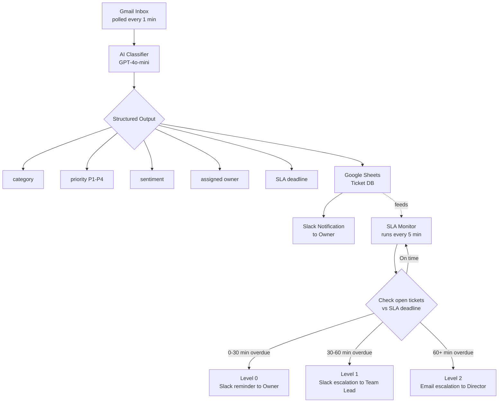

# AI Ticket Routing & SLA Escalation System

> Automated email-to-ticket classification, ownership routing, and multi-level SLA escalation built with **n8n**, **OpenAI**, **Gmail**, **Google Sheets**, and **Slack**.

[](https://n8n.io)
[](https://openai.com)
[](LICENSE)

---

## Table of Contents

- [Overview](#overview)
- [Problem](#problem)
- [Solution](#solution)
- [Architecture](#architecture)
- [Repository Structure](#repository-structure)
- [Workflows](#workflows)
- [Priority & SLA Rules](#priority--sla-rules)
- [Escalation Logic](#escalation-logic)
- [Setup](#setup)
- [Configuration](#configuration)
- [Results](#results)
- [Tech Stack](#tech-stack)
- [License](#license)

---

## Overview

An e-commerce furniture company was handling all customer support through a **single shared Gmail inbox**. As volume grew, manual triage could no longer keep up — prioritization depended on whoever read the email first, SLA tracking was reactive, and breaches were usually discovered only after a customer escalated.

This project replaces that manual workflow with an **AI-powered ticket routing and SLA enforcement pipeline** built entirely on n8n. Incoming emails are automatically classified, assigned an owner and priority, logged to a centralized database, and continuously monitored for SLA compliance — with automatic multi-level escalation when deadlines are missed.

## Problem

The manual support workflow caused several operational issues:

- All requests handled in one unstructured inbox
- Prioritization based on individual judgment, not rules
- SLA tracking was inconsistent and largely reactive
- High-priority issues mixed in with low-severity requests
- No structured ownership assignment or escalation logic
- SLA breaches detected late — sometimes only after customer complaint
- No centralized view of support performance

## Solution

An automated pipeline that:

1. **Classifies** every inbound email using an LLM (category, priority, sentiment, owner, SLA deadline)
2. **Logs** every ticket to a centralized Google Sheets database
3. **Notifies** the assigned owner via Slack immediately
4. **Monitors** all open tickets every 5 minutes against their SLA deadline
5. **Escalates** automatically — agent → team lead → director — based on how overdue a ticket is

## Architecture



## Repository Structure

```
.
├── README.md
├── workflows/
│   ├── 01_ticket_classification.json     # Gmail → AI classify → Sheets → Slack
│   └── 02_sla_monitor_escalation.json    # SLA polling + 3-level escalation engine
├── docs/
│   └── sheet_schema.md                   # Google Sheets ticket DB column reference
└── LICENSE
```

> **Note:** Place your exported n8n workflow JSON files in the `workflows/` folder, named as above (or update the names to match your exports). Each workflow can be imported directly into n8n via **Workflows → Import from File**.

## Workflows

### 1. `01_ticket_classification.json` — AI Ticket Classification

| Step | Node type | Description |
|---|---|---|
| Trigger | Gmail Trigger | Polls inbox every 1 minute for new messages |
| Parse | Set / Code | Normalizes email into a structured ticket object |
| Classify | OpenAI (GPT-4o-mini) | Structured output: category, priority, sentiment, owner, SLA deadline |
| Store | Google Sheets | Appends row to the centralized ticket database |
| Notify | Slack | Sends ticket details to the assigned owner's channel/DM |

### 2. `02_sla_monitor_escalation.json` — SLA Monitoring & Escalation

| Step | Node type | Description |
|---|---|---|
| Trigger | Schedule Trigger | Runs every 5 minutes |
| Fetch | Google Sheets | Reads all tickets with status = open |
| Evaluate | Code / IF | Compares current time against each ticket's SLA deadline |
| Route | Switch | Routes overdue tickets to the correct escalation level |
| Escalate | Slack / Gmail | Sends reminder or escalation notification per level |
| Update | Google Sheets | Updates escalation level and last-notified timestamp |

## Priority & SLA Rules

| Priority | Examples | Typical SLA |
|---|---|---|
| **P1** | Payment failures, system outages, critical delivery issues | Fastest response window |
| **P2** | Delivery delays, damaged goods, high-urgency complaints | Short response window |
| **P3** | Standard support requests | Standard response window |
| **P4** | Consultations, low-priority inquiries | Relaxed response window |

> Adjust exact SLA minute thresholds per priority inside the AI classification prompt or in `docs/sheet_schema.md`.

## Escalation Logic

| Level | Overdue window | Action |
|---|---|---|
| **Level 0** | 0–30 min overdue | Slack reminder to the assigned **owner** |
| **Level 1** | 30–60 min overdue | Slack escalation to the **team lead** |
| **Level 2** | 60+ min overdue | Email escalation to the **director** |

The SLA monitor re-checks every open ticket on every 5-minute run, so a ticket's escalation level only ever moves forward — it is never re-notified at a level it has already passed.

## Setup

1. **Import workflows** into your n8n instance:
   - `Workflows → Import from File` → select each `.json` file in `workflows/`
2. **Connect credentials** for:
   - Gmail (OAuth2)
   - OpenAI API key
   - Google Sheets (OAuth2 or service account)
   - Slack (Bot token with `chat:write` scope)
3. **Create the ticket database** in Google Sheets using the schema in `docs/sheet_schema.md`
4. **Update node references** (Sheet ID, Slack channel IDs, email addresses for director escalation) inside both workflows
5. **Activate** both workflows

## Configuration

Key values to set per environment (directly in the relevant nodes, or via n8n environment variables / credentials):

- `GOOGLE_SHEET_ID` — target spreadsheet for the ticket database
- `SLACK_CHANNEL_OWNERS` / owner-to-Slack-ID mapping
- `SLACK_CHANNEL_TEAM_LEADS`
- `DIRECTOR_EMAIL`
- `OPENAI_MODEL` — defaults to `gpt-4o-mini`
- SLA thresholds per priority (P1–P4)

## Results

- **100%** of incoming tickets automatically classified — manual triage eliminated
- Routing time reduced from **3–10 minutes → under 3 seconds** per ticket
- SLA breach detection improved from **hours → under 5 minutes**
- Higher SLA compliance through continuous monitoring and escalation
- No more lost or untracked tickets — fully centralized logging
- Fully automated **3-level escalation system** (agent → team lead → director)
- **~80%** reduction in manual support coordination workload
- Replaced a **€4,000–€5,000/month** coordination workload with a **$20–$30/month** automated system

## Tech Stack

- [n8n](https://n8n.io) — workflow orchestration
- Gmail API — inbox monitoring & email sending
- OpenAI GPT-4o-mini — ticket classification with structured output parsing
- Google Sheets — centralized ticket database
- Slack API — owner and team-lead notifications
- Custom SLA monitoring & role-based escalation logic

## License

This project is licensed under the [MIT License](LICENSE).
